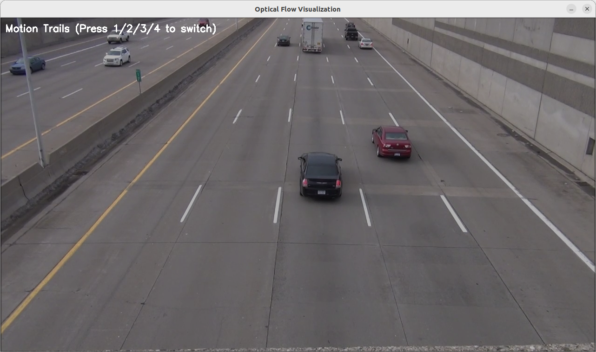
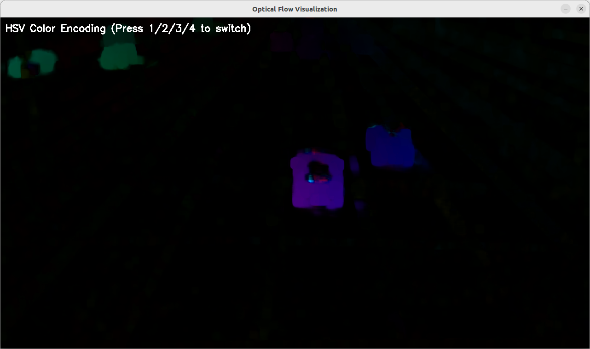
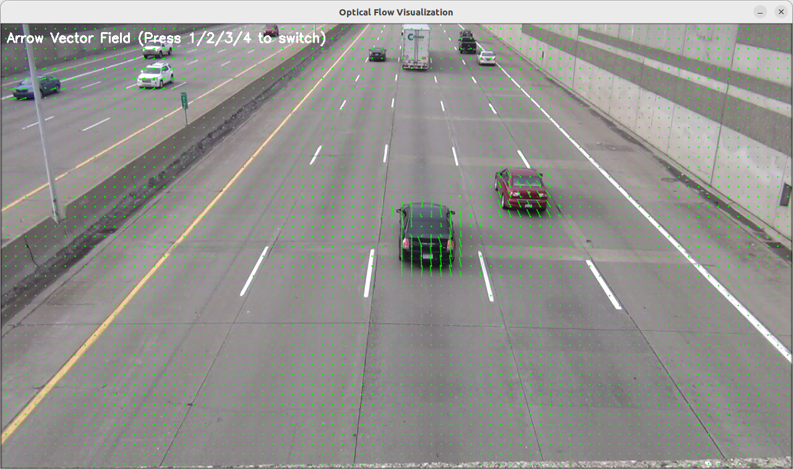
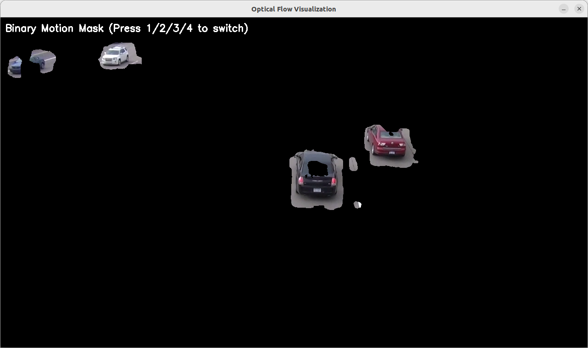

# 并行计算大作业

## opencv calcOpticalFlowFarneback详解
`cv::calcOpticalFlowFarneback` 是 OpenCV 中用于 稠密光流（Dense Optical Flow） 计算的函数，基于 Gunnar Farneback 提出的算法。它能够计算图像中 每个像素的运动向量（而不仅仅是特征点），适用于运动分析、视频稳定、动作识别等场景。

---

**1. 函数原理**
Farneback 算法是一种基于 多项式展开（Polynomial Expansion） 的稠密光流方法，核心思想是：
1. 局部多项式近似：将图像局部区域建模为二次多项式（如 \( I(x) \approx x^T A x + b^T x + c \)）。
2. 运动估计：假设相邻帧间多项式系数变化由平移引起，通过最小化误差求解位移向量。
3. 金字塔分层（Pyramid）：使用图像金字塔处理不同尺度的运动，提升对大运动的鲁棒性。

---

**2. 函数原型**
```cpp
void cv::calcOpticalFlowFarneback(
    InputArray prevImg,        // 前一帧图像（单通道，8位或浮点型）
    InputArray nextImg,        // 后一帧图像（同prevImg格式）
    InputOutputArray flow,     // 输出的光流场（CV_32FC2格式，每个像素存储位移向量 (dx, dy)）
    double pyrScale,           // 金字塔缩放因子（通常0.5）
    int levels,                // 金字塔层数（例如3）
    int winsize,               // 滑动窗口大小（奇数，如15）
    int iterations,            // 每层金字塔的迭代次数（如3）
    int polyN,                 // 多项式展开的邻域大小（通常5或7）
    double polySigma,          // 多项式展开的高斯标准差（通常1.1）
    int flags                  // 可选标志（如OPTFLOW_USE_INITIAL_FLOW）
);
```

---

**3. 参数详解**
| 参数 | 作用 | 推荐值 |
|------|------|--------|
| `pyrScale` | 金字塔每层的缩放比例（0.5 表示缩小一半） | 0.5 |
| `levels` | 金字塔层数（层数越多，处理大运动能力越强，但计算量增大） | 3~5 |
| `winsize` | 滑动窗口大小（越大对噪声鲁棒性越强，但会模糊运动边界） | 15~21（奇数） |
| `iterations` | 每层金字塔的迭代优化次数 | 3~5 |
| `polyN` | 多项式展开的邻域大小（通常5或7） | 5 |
| `polySigma` | 高斯平滑的标准差（与`polyN`配合使用） | 1.1 |
| `flags` | 可选标志：<br>• `OPTFLOW_USE_INITIAL_FLOW`：使用输入的flow作为初始估计<br>• `OPTFLOW_FARNEBACK_GAUSSIAN`：用高斯窗口代替均值窗口 | 0 |

---

**4. 代码示例**
**(1) 基础光流计算**
```cpp
#include <opencv2/opencv.hpp>
using namespace cv;

int main() {
    // 读取连续两帧灰度图像
    Mat prevImg = imread("frame1.jpg", IMREAD_GRAYSCALE);
    Mat nextImg = imread("frame2.jpg", IMREAD_GRAYSCALE);
    if (prevImg.empty() || nextImg.empty()) return -1;

    // 计算光流
    Mat flow;
    calcOpticalFlowFarneback(
        prevImg, nextImg, flow, 
        0.5, 3, 15, 3, 5, 1.1, 0
    );

    // 可视化光流
    Mat flowParts[2];
    split(flow, flowParts);
    Mat magnitude, angle;
    cartToPolar(flowParts[0], flowParts[1], magnitude, angle, true);
    normalize(magnitude, magnitude, 0, 255, NORM_MINMAX);
    Mat flowViz;
    applyColorMap(magnitude, flowViz, COLORMAP_JET);
    imshow("Optical Flow", flowViz);
    waitKey(0);

    return 0;
}
```

**(2) 可视化运动向量**
```cpp
// 在原图上绘制箭头表示运动方向
void drawOpticalFlow(const Mat& flow, Mat& img, int step = 16) {
    for (int y = 0; y < img.rows; y += step) {
        for (int x = 0; x < img.cols; x += step) {
            Point2f f = flow.at<Point2f>(y, x);
            arrowedLine(img, Point(x, y), Point(cvRound(x + f.x), cvRound(y + f.y)), 
                       Scalar(0, 255, 0), 1, 8, 0, 0.3);
        }
    }
}

// 在主函数中调用
drawOpticalFlow(flow, prevImg);
imshow("Flow Vectors", prevImg);
```

---

**5. 关键问题与优化**
**Q1: 如何提升计算速度？**
• 减小 `levels` 或 `winsize`（但会降低精度）。

• 使用 GPU 加速（OpenCV CUDA 模块的 `cv::cuda::FarnebackOpticalFlow`）。

• 对图像降采样（如先缩放到一半大小）。


**Q2: 如何提高对小运动的灵敏度？**
• 增加 `levels` 或减小 `pyrScale`（如0.8）。

• 减小 `winsize`（如9）。


**Q3: 如何处理噪声？**
• 增大 `winsize` 或 `polyN`。

• 对输入图像先做高斯模糊。


---

**6. 应用场景**
1. 视频稳定：通过光流补偿相机运动。
2. 动作识别：分析人体关节运动模式。
3. 自动驾驶：估计车辆或行人的运动方向。
4. 背景减除：分离运动前景与静态背景。

---

**7. 对比其他光流算法**
| 方法 | 类型 | 速度 | 精度 | 适用场景 |
|------|------|------|------|----------|
| Farneback | 稠密 | 中等 | 较高 | 通用场景 |
| Lucas-Kanade | 稀疏 | 快 | 较低 | 特征点跟踪 |
| DeepFlow (CNN) | 稠密 | 慢 | 高 | 复杂运动 |

---

**总结**
• 核心参数：`pyrScale`、`levels`、`winsize` 对结果影响最大。

• 输出格式：光流场是 `CV_32FC2` 矩阵，存储每个像素的 `(dx, dy)`。

• 优化方向：平衡速度与精度时，优先调整金字塔参数和窗口大小。


通过合理调参，Farneback 算法能在多数场景下提供可靠的光流估计。如需实时性能，建议结合 GPU 加速或改用稀疏光流方法（如 Lucas-Kanade）。

### 原图

### 颜色编码图

### 矢量箭头图

### 运动分割掩码图
