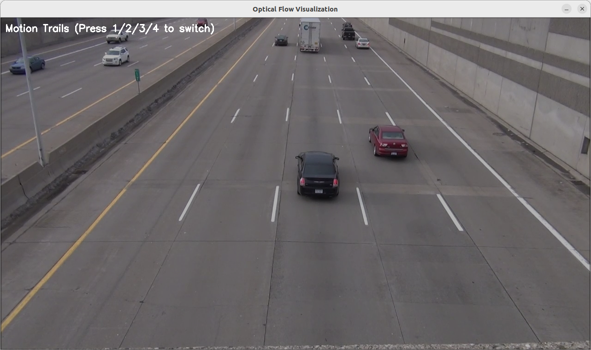
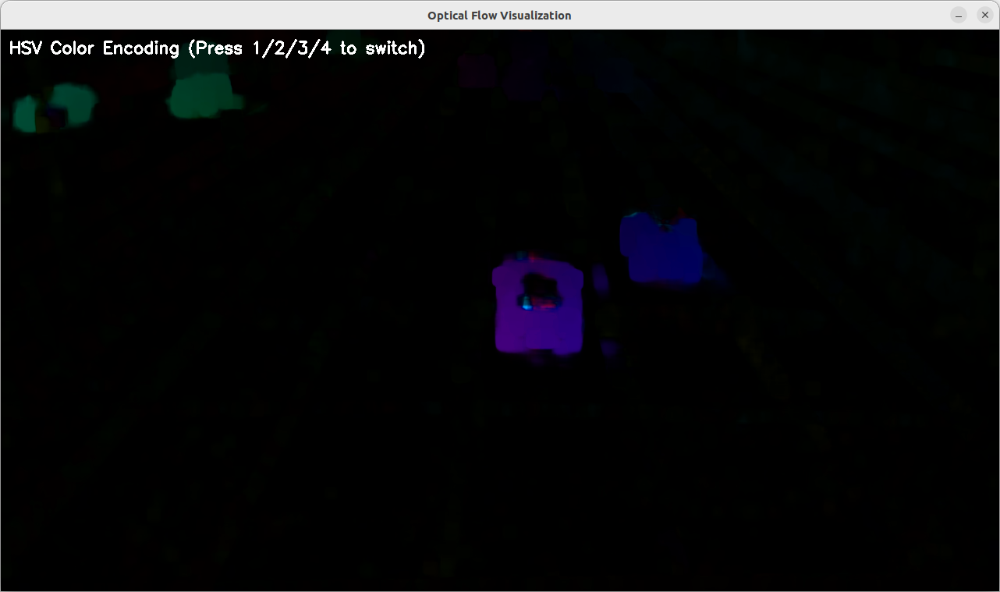
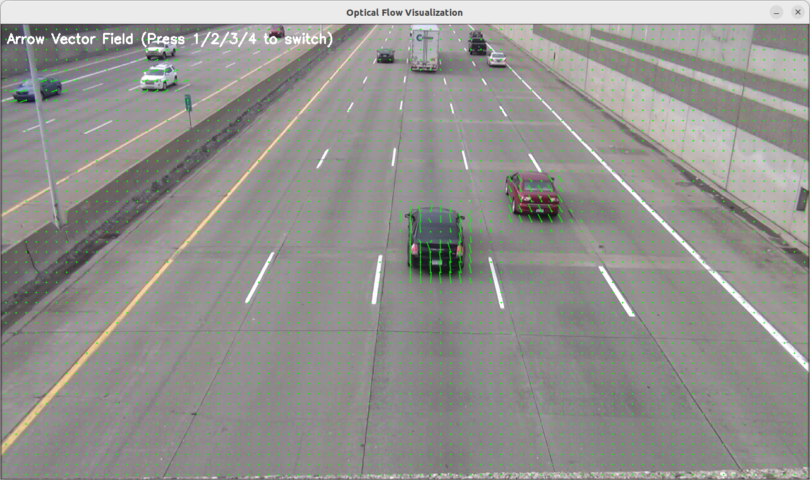
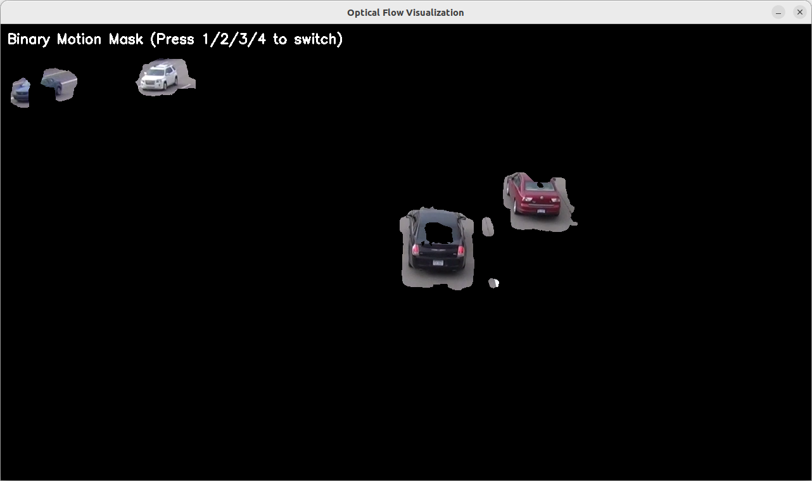

# 并行计算大作业

## opencv calcOpticalFlowFarneback详解
`cv::calcOpticalFlowFarneback` 是 OpenCV 中用于 稠密光流（Dense Optical Flow） 计算的函数，基于 Gunnar Farneback 提出的算法。它能够计算图像中 每个像素的运动向量（而不仅仅是特征点），适用于运动分析、视频稳定、动作识别等场景。

---

**1. 函数原理**
Farneback 算法是一种基于 多项式展开（Polynomial Expansion） 的稠密光流方法，核心思想是：
1. 局部多项式近似：将图像局部区域建模为二次多项式（如 \( I(x) \approx x^T A x + b^T x + c \)）。
2. 运动估计：假设相邻帧间多项式系数变化由平移引起，通过最小化误差求解位移向量。
3. 金字塔分层（Pyramid）：使用图像金字塔处理不同尺度的运动，提升对大运动的鲁棒性。

---

**2. 函数原型**
```cpp
void cv::calcOpticalFlowFarneback(
    InputArray prevImg,        // 前一帧图像（单通道，8位或浮点型）
    InputArray nextImg,        // 后一帧图像（同prevImg格式）
    InputOutputArray flow,     // 输出的光流场（CV_32FC2格式，每个像素存储位移向量 (dx, dy)）
    double pyrScale,           // 金字塔缩放因子（通常0.5）
    int levels,                // 金字塔层数（例如3）
    int winsize,               // 滑动窗口大小（奇数，如15）
    int iterations,            // 每层金字塔的迭代次数（如3）
    int polyN,                 // 多项式展开的邻域大小（通常5或7）
    double polySigma,          // 多项式展开的高斯标准差（通常1.1）
    int flags                  // 可选标志（如OPTFLOW_USE_INITIAL_FLOW）
);
```

---

**3. 参数详解**
| 参数 | 作用 | 推荐值 |
|------|------|--------|
| `pyrScale` | 金字塔每层的缩放比例（0.5 表示缩小一半） | 0.5 |
| `levels` | 金字塔层数（层数越多，处理大运动能力越强，但计算量增大） | 3~5 |
| `winsize` | 滑动窗口大小（越大对噪声鲁棒性越强，但会模糊运动边界） | 15~21（奇数） |
| `iterations` | 每层金字塔的迭代优化次数 | 3~5 |
| `polyN` | 多项式展开的邻域大小（通常5或7） | 5 |
| `polySigma` | 高斯平滑的标准差（与`polyN`配合使用） | 1.1 |
| `flags` | 可选标志：<br>• `OPTFLOW_USE_INITIAL_FLOW`：使用输入的flow作为初始估计<br>• `OPTFLOW_FARNEBACK_GAUSSIAN`：用高斯窗口代替均值窗口 | 0 |

---

**4. 代码示例**
**(1) 基础光流计算**
```cpp
#include <opencv2/opencv.hpp>
using namespace cv;

int main() {
    // 读取连续两帧灰度图像
    Mat prevImg = imread("frame1.jpg", IMREAD_GRAYSCALE);
    Mat nextImg = imread("frame2.jpg", IMREAD_GRAYSCALE);
    if (prevImg.empty() || nextImg.empty()) return -1;

    // 计算光流
    Mat flow;
    calcOpticalFlowFarneback(
        prevImg, nextImg, flow, 
        0.5, 3, 15, 3, 5, 1.1, 0
    );

    // 可视化光流
    Mat flowParts[2];
    split(flow, flowParts);
    Mat magnitude, angle;
    cartToPolar(flowParts[0], flowParts[1], magnitude, angle, true);
    normalize(magnitude, magnitude, 0, 255, NORM_MINMAX);
    Mat flowViz;
    applyColorMap(magnitude, flowViz, COLORMAP_JET);
    imshow("Optical Flow", flowViz);
    waitKey(0);

    return 0;
}
```

**(2) 可视化运动向量**
```cpp
// 在原图上绘制箭头表示运动方向
void drawOpticalFlow(const Mat& flow, Mat& img, int step = 16) {
    for (int y = 0; y < img.rows; y += step) {
        for (int x = 0; x < img.cols; x += step) {
            Point2f f = flow.at<Point2f>(y, x);
            arrowedLine(img, Point(x, y), Point(cvRound(x + f.x), cvRound(y + f.y)), 
                       Scalar(0, 255, 0), 1, 8, 0, 0.3);
        }
    }
}

// 在主函数中调用
drawOpticalFlow(flow, prevImg);
imshow("Flow Vectors", prevImg);
```

---

**5. 关键问题与优化**
**Q1: 如何提升计算速度？**
• 减小 `levels` 或 `winsize`（但会降低精度）。

• 使用 GPU 加速（OpenCV CUDA 模块的 `cv::cuda::FarnebackOpticalFlow`）。

• 对图像降采样（如先缩放到一半大小）。


**Q2: 如何提高对小运动的灵敏度？**
• 增加 `levels` 或减小 `pyrScale`（如0.8）。

• 减小 `winsize`（如9）。


**Q3: 如何处理噪声？**
• 增大 `winsize` 或 `polyN`。

• 对输入图像先做高斯模糊。


---

**6. 应用场景**
1. 视频稳定：通过光流补偿相机运动。
2. 动作识别：分析人体关节运动模式。
3. 自动驾驶：估计车辆或行人的运动方向。
4. 背景减除：分离运动前景与静态背景。

---

**7. 对比其他光流算法**
| 方法 | 类型 | 速度 | 精度 | 适用场景 |
|------|------|------|------|----------|
| Farneback | 稠密 | 中等 | 较高 | 通用场景 |
| Lucas-Kanade | 稀疏 | 快 | 较低 | 特征点跟踪 |
| DeepFlow (CNN) | 稠密 | 慢 | 高 | 复杂运动 |

---

**总结**
• 核心参数：`pyrScale`、`levels`、`winsize` 对结果影响最大。

• 输出格式：光流场是 `CV_32FC2` 矩阵，存储每个像素的 `(dx, dy)`。

• 优化方向：平衡速度与精度时，优先调整金字塔参数和窗口大小。


通过合理调参，Farneback 算法能在多数场景下提供可靠的光流估计。如需实时性能，建议结合 GPU 加速或改用稀疏光流方法（如 Lucas-Kanade）。

### 原图

### 颜色编码图

### 矢量箭头图

### 运动分割掩码图



CUDA并行计算方法说明

这段代码实现了基于CUDA的Farneback光流算法，主要使用了以下几种并行计算方法：

1. 数据并行 (Data Parallelism)

这是最基础的并行模式，将图像数据划分为多个块，由不同的CUDA线程并行处理：

• 图像转换：`convertToFloatKernel`将每个像素独立转换为浮点数

• 金字塔下采样：`pyrDownKernel`对每个输出像素并行计算2x2邻域的平均值

• 流场上采样：`pyrUpFlowKernel`对每个输出像素并行进行双线性插值

• 多项式展开：`polyExpansionKernel`对每个像素并行计算其邻域的多项式系数

• 光流计算：`computeFlowKernel`对每个像素并行求解光流方程


2. 任务并行 (Task Parallelism)

通过CUDA流(stream)实现不同操作之间的流水线并行：

• 使用`cudaStream_t`创建CUDA流

• 多个核函数调用使用相同的流，实现异步执行


3. 分层并行 (Hierarchical Parallelism)

光流计算采用金字塔分层结构：

• 从粗到细(coarse-to-fine)的多层处理

• 每层使用不同分辨率的图像和流场

• 高层结果作为低层的初始值


4. 迭代并行 (Iterative Parallelism)

在每层金字塔上进行多次迭代优化：

• 每次迭代包含图像变形、多项式展开和流场更新

• 迭代之间是串行的，但每次迭代内部是并行的


5. 内存访问优化

• 合并内存访问：线程访问连续的内存区域，提高带宽利用率

• 共享内存：虽然代码中没有显式使用共享内存，但CUDA会自动利用共享内存优化局部访问

• 常量内存：高斯核系数存储在常量内存中，提高访问速度


6. 线程组织

• 使用二维线程块(BLOCK_SIZE x BLOCK_SIZE)组织

• 每个线程块处理图像的一个局部区域

• 网格维度根据图像大小自动计算


7. 同步机制

• 隐式同步：通过核函数调用实现粗粒度同步

• 流内同步：同一流内的操作按顺序执行


这种混合并行策略充分利用了GPU的并行计算能力，特别是对图像处理这种高度并行的任务非常有效。


以下是代码中关键并行计算的位置及其作用分析：

---

**1. 基础图像处理并行化**
**(1) 图像转浮点 (`convertToFloatKernel`)**  
位置:  
```cpp
__global__ void convertToFloatKernel(const unsigned char* input, float* output, int width, int height) {
    int x = blockIdx.x * blockDim.x + threadIdx.x;
    int y = blockIdx.y * blockDim.y + threadIdx.y;
    if (x < width && y < height) {
        output[y * width + x] = static_cast<float>(input[y * width + x]) / 255.0f;
    }
}
```
作用:  
• 每个CUDA线程处理一个像素，并行完成整张图像的归一化（`[0,255]` → `[0,1]`）。

• 并行粒度: 像素级并行。


---

**(2) 金字塔下采样 (`pyrDownKernel`)**  
位置:  
```cpp
__global__ void pyrDownKernel(const float* src, float* dst, int srcWidth, int srcHeight, int dstWidth) {
    int x = blockIdx.x * blockDim.x + threadIdx.x;
    int y = blockIdx.y * blockDim.y + threadIdx.y;
    if (x < dstWidth && y < dstHeight) {
        // 对每个输出像素，并行计算2x2邻域的平均值
        dst[y * dstWidth + x] = 0.25f * (src[2*y*srcWidth + 2*x] + ...);
    }
}
```
作用:  
• 每个线程计算一个下采样后的像素值（2x2邻域平均）。

• 并行粒度: 输出图像像素级并行。


---

**2. 光流核心算法并行化**
**(3) 多项式展开 (`polyExpansionKernel`)**  
位置:  
```cpp
__global__ void polyExpansionKernel(const float* src, float* dst, int width, int height, 
                                  int poly_n, const float* g_kernel) {
    int x = blockIdx.x * blockDim.x + threadIdx.x;
    int y = blockIdx.y * blockDim.y + threadIdx.y;
    if (x < width && y < height) {
        // 每个线程计算一个像素的多项式系数（6个系数）
        for (int j = -radius; j <= radius; j++) {
            for (int i = -radius; i <= radius; i++) {
                // 加权累加计算多项式系数
            }
        }
    }
}
```
作用:  
• 每个线程处理一个像素，计算其邻域（`poly_n x poly_n`）的加权多项式展开。

• 关键点: 虽然每个线程需要遍历邻域，但不同像素的计算是完全并行的。

• 并行粒度: 像素级并行，但存在局部内存访问（可通过共享内存优化）。


---

**(4) 光流计算 (`computeFlowKernel`)**  
位置:  
```cpp
__global__ void computeFlowKernel(const float* poly1, const float* poly2, float* flow, 
                                int width, int height, int winsize, const float* g_kernel) {
    int x = blockIdx.x * blockDim.x + threadIdx.x;
    int y = blockIdx.y * blockDim.y + threadIdx.y;
    if (x < width && y < height) {
        // 每个线程求解一个像素的光流（u,v）
        for (int j = -radius; j <= radius; j++) {
            for (int i = -radius; i <= radius; i++) {
                // 构建最小二乘系统 A*x = b
            }
        }
        // 解2x2线性方程组
        flow[(y*width + x)*2] = u;  // x分量
        flow[(y*width + x)*2 + 1] = v; // y分量
    }
}
```
作用:  
• 每个线程独立计算一个像素的光流向量（`u,v`），通过邻域（`winsize x winsize`）的加权最小二乘求解。

• 并行粒度: 像素级并行，是光流算法的核心并行部分。


---

**(5) 流场更新 (`updateFlowKernel`)**  
位置:  
```cpp
__global__ void updateFlowKernel(float* flow, const float* update, int width, int height) {
    int x = blockIdx.x * blockDim.x + threadIdx.x;
    int y = blockIdx.y * blockDim.y + threadIdx.y;
    if (x < width && y < height) {
        // 每个线程更新一个像素的流场（x和y分量）
        flow[(y*width + x)*2] += update[(y*width + x)*2];
        flow[(y*width + x)*2 + 1] += update[(y*width + x)*2 + 1];
    }
}
```
作用:  
• 每个线程独立更新一个像素的光流值（加法操作）。

• 并行粒度: 像素级并行，是迭代优化的最后一步。


---

**3. 图像变形并行化**
**(6) 图像变形 (`warpImageKernel`)**  
位置:  
```cpp
__global__ void warpImageKernel(const float* src, float* dst, const float* flow, 
                              int width, int height) {
    int x = blockIdx.x * blockDim.x + threadIdx.x;
    int y = blockIdx.y * blockDim.y + threadIdx.y;
    if (x < width && y < height) {
        // 每个线程根据流场（flow）对目标图像插值
        float srcX = x - flow[(y*width + x)*2];
        float srcY = y - flow[(y*width + x)*2 + 1];
        // 双线性插值
        dst[y*width + x] = (1-wx)*(1-wy)*src[y0*width + x0] + ...;
    }
}
```
作用:  
• 每个线程根据流场（`flow`）对目标图像进行反向映射和插值。

• 并行粒度: 像素级并行，是迭代中图像变形的关键步骤。


---

**4. 金字塔上采样并行化**
**(7) 流场上采样 (`pyrUpFlowKernel`)**  
位置:  
```cpp
__global__ void pyrUpFlowKernel(const float* src, float* dst, int srcWidth, int srcHeight, 
                              int dstWidth, float scale) {
    int x = blockIdx.x * blockDim.x + threadIdx.x;
    int y = blockIdx.y * blockDim.y + threadIdx.y;
    if (x < dstWidth && y < dstHeight) {
        // 每个线程对光流场进行双线性插值上采样
        dst[(y*dstWidth + x)*2] = scale * ((1-wx)*(1-wy)*src[...] + ...);
        dst[(y*dstWidth + x)*2 + 1] = scale * ((1-wx)*(1-wy)*src[...] + ...);
    }
}
```
作用:  
• 每个线程将低分辨率流场插值到高分辨率。

• 并行粒度: 输出图像像素级并行，用于金字塔层级间的流场传递。


---

**总结：关键并行特征**
1. 像素级并行：所有核函数均以像素为基本处理单元。
2. 分层并行：金字塔不同层级的光流计算独立并行。
3. 迭代内并行：每次迭代中的多项式展开、光流计算、图像变形均并行执行。
4. 数据依赖性低：除流场更新外，大部分操作无跨像素依赖。

优化建议：  
• 在多项式展开和光流计算中，邻域访问可通过共享内存（`__shared__`）优化。

• 使用CUDA的异步操作（如`cudaMemcpyAsync`）隐藏数据传输延迟。