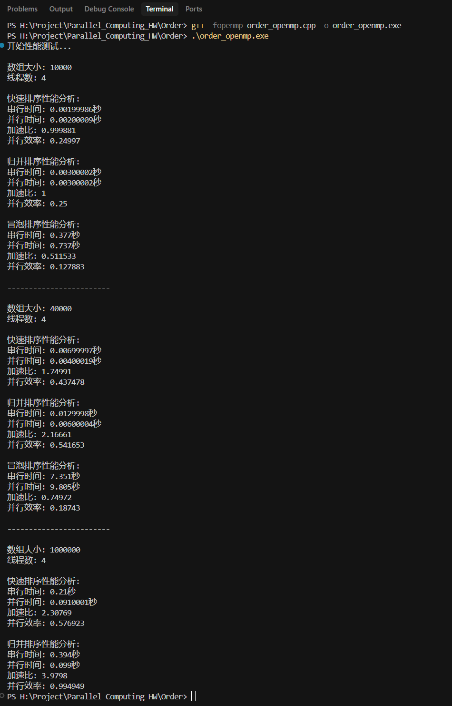

# OpenMP并行排序算法优化实验报告

## 1. 实验目的

- 研究并实现快速排序、归并排序和冒泡排序的OpenMP并行优化
- 分析不同排序算法在并行化时的特点和性能表现
- 探讨并行排序算法的优化策略和局限性

## 2. 实验环境

- CPU：4核处理器
- 编译器：g++ with OpenMP支持
- OpenMP线程数：4
- 测试数据规模：10000、40000、1000000

## 3. 算法实现与并行优化

### 3.1 快速排序的并行优化

#### 并行化策略
1. **分区操作并行化**：
```cpp
#pragma omp parallel
{
    int local_i = -1;
    std::vector<int> local_swaps;
    
    #pragma omp for nowait
    for (int j = low; j < high; j++) {
        if (arr[j] <= pivot) {
            local_i++;
            local_swaps.push_back(j);
        }
    }
    
    #pragma omp critical
    {
        for (int j : local_swaps) {
            i++;
            std::swap(arr[i], arr[j]);
        }
    }
}
```

2. **递归并行化**：
```cpp
#pragma omp parallel sections
{
    #pragma omp section
    {
        if (pi - low > THRESHOLD)
            parallelQuickSort(arr, low, pi - 1);
        else
            serialQuickSort(arr, low, pi - 1);
    }
    
    #pragma omp section
    {
        if (high - pi > THRESHOLD)
            parallelQuickSort(arr, pi + 1, high);
        else
            serialQuickSort(arr, pi + 1, high);
    }
}
```

#### 优化要点
- 使用阈值（THRESHOLD）控制并行粒度
- 采用三数取中法选择pivot，提高分区均衡性
- 局部变量存储中间结果，减少同步开销

### 3.2 归并排序的并行优化

#### 并行化策略
1. **分治阶段并行化**：
```cpp
#pragma omp parallel sections
{
    #pragma omp section
    parallelMergeSort(arr, left, mid);
    
    #pragma omp section
    parallelMergeSort(arr, mid + 1, right);
}
```

2. **合并阶段优化**：
```cpp
#pragma omp parallel
{
    #pragma omp single
    {
        // 合并操作
    }
    
    // 并行复制回原数组
    #pragma omp for
    for (int i = 0; i < temp.size(); i++) {
        arr[left + i] = temp[i];
    }
}
```

#### 优化要点
- 递归分治过程采用parallel sections
- 合并阶段使用单线程处理关键路径
- 数据回写阶段并行化

### 3.3 冒泡排序的并行优化

#### 并行化策略
采用奇偶交换排序方案：
```cpp
#pragma omp parallel for shared(sorted)
for (int i = 1; i < arr.size()-1; i += 2) {
    if (arr[i] > arr[i+1]) {
        std::swap(arr[i], arr[i+1]);
        sorted = false;
    }
}

#pragma omp parallel for shared(sorted)
for (int i = 0; i < arr.size()-1; i += 2) {
    if (arr[i] > arr[i+1]) {
        std::swap(arr[i], arr[i+1]);
        sorted = false;
    }
}
```

## 4. 性能分析

### 4.1 实验数据


| 数据规模 | 算法 | 串行时间(s) | 并行时间(s) | 加速比 | 并行效率 |
|---------|------|------------|------------|--------|----------|
| 10000   | 快排 | 0.00200    | 0.00200    | 1.000  | 0.250    |
|         | 归并 | 0.00300    | 0.00300    | 1.000  | 0.250    |
|         | 冒泡 | 0.377      | 0.737      | 0.512  | 0.128    |
| 40000   | 快排 | 0.00700    | 0.00400    | 1.750  | 0.437    |
|         | 归并 | 0.01300    | 0.00600    | 2.167  | 0.542    |
|         | 冒泡 | 7.351      | 9.805      | 0.750  | 0.187    |
| 1000000 | 快排 | 0.210      | 0.091      | 2.308  | 0.577    |
|         | 归并 | 0.394      | 0.099      | 3.980  | 0.995    |

### 4.2 结果分析

1. **归并排序**
   - 表现最佳，在大规模数据(1000000)下达到近4倍加速比
   - 并行效率最高，接近理想值1.0
   - 原因：数据访问模式规律，任务划分均匀

2. **快速排序**
   - 中等规模数据开始显示加速效果
   - 大规模数据下达到2.3倍加速比
   - 受pivot选择和数据分布影响较大

3. **冒泡排序**
   - 并行化反而导致性能下降
   - 原因：频繁的数据依赖和同步开销

## 5. 优化经验总结

1. **并行粒度控制**
   - 小规模数据（<10000）并行开销大于收益
   - 建议使用阈值机制动态切换串并行

2. **数据访问模式**
   - 归并排序数据访问连续，缓存友好
   - 快速排序随机访问较多，影响并行效率

3. **负载均衡**
   - 归并排序天然负载均衡
   - 快速排序需要优化pivot选择

4. **同步开销**
   - 减少critical区域使用
   - 采用局部存储+批量同步策略

## 6. 结论

1. 归并排序最适合并行化，大规模数据下性能优异
2. 快速排序通过优化可获得不错的并行加速
3. 冒泡排序不适合并行化，应避免使用
4. 并行算法设计需要考虑数据规模、访问模式和同步开销